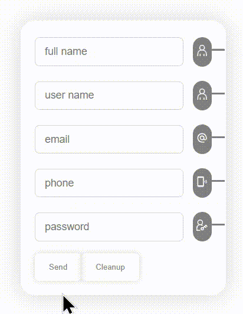

# <p align="center"> Hi there 👋 I'm Mohammad Hossein 👨‍💻 </p>
 <p align="center"> React Js expert and FrontEnd Developer from Iran.</p>

## Descripton Project
- Create a beautiful and very useful form on login and register pages and ... React JS. 

- Fully optimized and cleanly programmed, and the principle of being a base component in this project is respected. 

- This way, you no longer need to validate the server-side validation, which means that you are following the DRY (Don Repeat Yourself) rule.

- This form is very flexible in terms of customization.

>### Languages
>> 
>>
>> 
>> 
>> 
>> 
>> 

>### Packages
>> 

## View of the project



## Getting Started

Before running the project, it is necessary to install npm on your system, then you can put the following command in the path of the project

and after installing the related packages run the project.

```
> npm install
```
OR
```
> npm i
```

Then, after you finish installing the packages, run this command to start your React program.

```
> npm start
```

### `npm start`

Runs the app in the development mode.\
Open [http://localhost:3000](http://localhost:3000) to view it in your browser.

The page will reload when you make changes.\
You may also see any lint errors in the console.

### Guid
If you are not installed on your system Node.js and Npm, go to this [Link Install](https://nodejs.org/en/download) and install and then proceed to the above steps

Install Node.js and NPM in Windows via Node.js Installer

___
>### Social Network
> [](https://github.com/khadem-mh)
> [](https://pinterest.com/khadem_mh)
> [](https://t.me/mhkhadem)
> [](https://wa.me/989031335939)
> [](https://wakatime.com/@khadem_mh)
